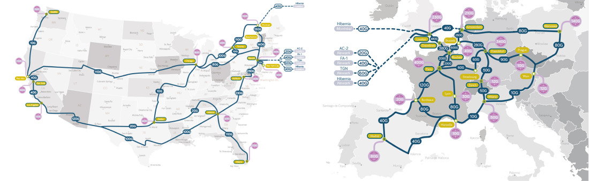

# What is a Seedbox?

Classically a seedbox was the term given to any device that was dedicated to the task of seeding torrent files as effectively and consitently as possible. The main reason to do this was in order achieve an upload ratio in excess of the download ratio for those torrents. Most seedboxes were pretty basic setups doing a pretty basic task and were not always remotely hosted. Each setup tended to be unique to the user and the barrier to entry required a firm grasp of linux admistration and financial investment. The remote hosted versions tended to have access to high capacity resources that made them very effective at this task compared to home hosted versions but were not an afforable option to most users.

OVH and their European datacenters became the defacto home for many of these seedbox setups and many providers grew out of sharing and reselling their servers to cover the costs of running their seedboxes at OVH. This where the idea of racing and automation started to gather real momentum and various tools, setups and platforms took form to demystify the concept.

Nowadays, when talking about a Seedbox we are typically referring to a remotely hosted server in a European datacentre, running Ubuntu or Debian Linux. It will be configured to provide an end user (you) access to the required tools needed to enable the management of data aquired via torrents, usenet and hosting services in a networking environment much better suited to this workload than is often found at the end of a residential internet connection.

How exactly this is done and how the end user can interact with and manage their data varies dramatically from one solution to another.

In its basic form it can simply enable you to:

* Downloading and managing torrent files from public or private trackers.
* Transferring that data from the remote host to a local location for consumption.
* Access to cheaper but limited solutions. Perhaps in terms of hardware or the sharing of resources.
* Expect generic forms of support.

In it's advanced form it can also include:

* Powerful hardware for a single individual or entire hard drives with no shared users.
* Premium bandwidth and data center options.
* The automation of sourcing and managing of the data.
* The running of remote applications to extend functionality beyond the fundamental requirements.

## Managed vs Unmanaged

The first two important considerations when choosing a seedbox would be a managed vs unmanaged service.

Managed | Unmanaged
---|---
A managed seedbox is one where another person or service manage part or all of the service you experience. This will primarily cover areas such as maintenance, security, abuse, other users and core services provided. Usually these environments offer limited customization potential but will often have a wiki or knowledge base to support customization. A managed service with good support is always the best place to start out for a beginner who does not fully understand how this all works. | An unmanaged service is one where you generally have a lot more freedom to customize the environment, such as root access, but have all the responsibility of managing it. So things like program updates, server up time, security, user management, application installation and configuration tweaking become the end user's responsibility. For an advanced user this can provide for specific needs but often comes at an increased costs and it's often more time consuming to manage, all things considered. 

## The Tortoise or the Hare?

There are two main differences in seedbox implementations to consider, especially if you are looking for a reasonable monthly cost of let's say, up to $30. Though in theory it is possible to have the best of both if there is no budget requirement.

Performance based | Storage based | Factors to consider
---|---|---
 You will have access to powerful server hardware with moderate storage options, even less with SSD drives. So you have the potential to perform any task you might want to achieve but limited options in terms of storage over a longer period. Great for short term or storage light needs.| This will usually have a large storage volume via a mechanical hard drive solution. Very good for holding onto data for long periods of time. The compromise of this option is usually the raw power available of the seedbox is not suited to resource intensive operations like racing or trans-coding. |Seedbox or hosting providers may have payment options, privacy policies, abuse policies and terms and conditions you may wish to explore before signing up. For example, not all services allow public trackers. 

## Do I need root?

If you have to ask then you probably don't. A managed service can often provide more than the majority of users will ever need with a high level of support through  their wiki, the local community and the staff of the provider. Root access is rarely required and in many cases the need for it is overcome by installing applications locally, if supported. (most Linux applications support this when installing from source) 

## Why don't seedbox providers do backups?

The short answer is; you get what you pay for. Backups require double or triple the disk space and extra resources at large, therefore this increases costs. In order to stay competitive and cost effective automated backups have never really been part of the seedbox landscape. Seedboxes tend to focus on performance and prioritize certain needs over others. It just comes with the territory.

''If your data is important to you, then you should make it a priority to back it up. Otherwise you should expect to pay more for a service with this as part of their feature set.''

## Why use a seedbox?

Seedboxes used to be a complicated and inaccessible area with a steep learning curve. Today a seedbox can be a Swiss army knife or a finely edged blade. Thanks to the hard work of many great providers, communities and application developers the landscape has changed and it is now as simple as signing up to a service and away you go.

Whether you want to:

* Create and torrent and share something.
* Maintain a ratio in a private community you have invested heavily in.
* Bragging rights, you're a stat whore in search of statistical glory.
* A way to stream your personal music collection.
* You want to complete media solution with all the bells and whistles.
* Share files with your friends.
* A $5 dollar solution
* A dedicated server

Seedboxes have evolved to provide a platform for you to develop that need and there is a lot of great providers and information out there to help you do it where other hosting solutions fall short.

So it is harder to define what a seedbox is as a it can be many things to many people. Finding the right setup or provider for your needs will hopefully be something this Wiki will support you in doing by proving a fair and impartial view of the current landscape.

## [Glossary of Terms](https://www.reddit.com/r/seedboxes/wiki/glossary)